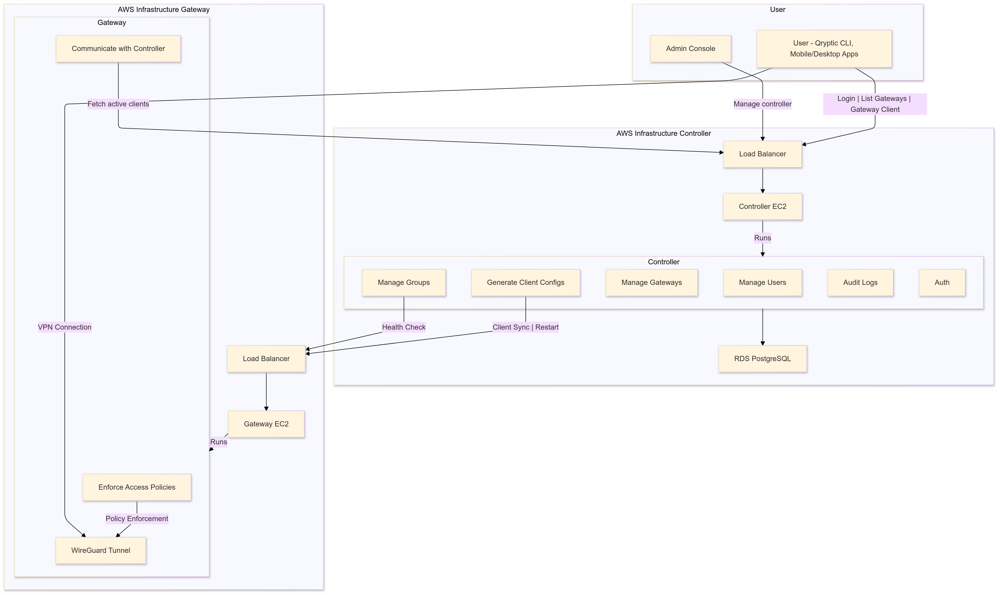

# Qryptic Documentation

## 1. Overview

Qryptic is a modern, open-source **Zero Trust Network Access (ZTNA)** solution powered by **WireGuard**, providing secure, fast, reliable and time-bound network access management. Unlike traditional VPNs, ZTNA ensures that users only access the specific resources they need, minimizing security risks and improving overall control.

### 🚀 Why ZTNA and Qryptic?

**ZTNA** is a modern and secure alternative to VPNs. Traditional VPNs grant broad network access, often leading to security risks and compliance challenges. ZTNA takes a different approach by ensuring least-privilege access and enforcing security policies at every step.

However, many ZTNA solutions present challenges such as:

- **Infrastructure Control:**  
  Does your ZTNA solution place all the controls within your own infrastructure (data center or cloud), or is the main controlling interface managed by the vendor?  
  Qryptic ensures **you** have full control over your infrastructure.

- **Public Exposure of Internal Tools:**  
  Are internally hosted third-party tools exposed to the public even when needed by only a few teams?  
  Qryptic helps segment and control access efficiently.

- **Data Residency & Compliance Challenges:**  
  Are you struggling with regulatory requirements related to **data residency and localization**?  
  Qryptic is designed to meet compliance needs by allowing self-hosting within your environment.

- **Cost of Adoption:**  
  Is onboarding a ZTNA solution too costly for your growing startup?  
  Qryptic provides an **affordable, self-hosted** alternative without recurring costs.

- **One VPN for All?**  
  Does your team rely on a **single VPN** to access internal services, leading to bottlenecks and security risks?  
  With Qryptic, you can manage **multiple VPNs** for different use cases from a single interface.

### 🔑 What Makes Qryptic Different?

Qryptic offers:

✅ **End-to-End Hosting:** Host the entire solution within your infrastructure, ensuring full control over data and security policies.  
✅ **Multi-VPN Management:** Manage multiple VPNs for different use cases via a centralized interface.  
✅ **WireGuard-Powered Security:** Benefit from WireGuard’s robust encryption and high-speed performance.  
✅ **Open Source Flexibility:** Customize and extend the solution to meet your specific business needs.  
✅ **Compliance-Focused:** Stay compliant with evolving regulatory requirements without vendor lock-in.

It consists of the following components:

1. **Controller**:

   - Manages users, groups, gateways, and access policies.
   - Generates time-bound client configurations for users.
   - Communicates with gateways to enforce access controls.

2. **Gateway**:

   - Enforces access controls using WireGuard.
   - Dynamically updates its configuration based on instructions from the Controller.

3. **User**:

   - Employees or users who need access to gateways.
   - Admins can manage the Controller and gateways.

4. **Group**:

   - A collection of users (e.g., a team) with shared access to gateways.

5. **Client**:
   - A temporary WireGuard configuration provided to users for connecting to gateways.
   - Automatically deleted by a cron job upon expiry.

---

## 2. Architecture

### High-Level Architecture




1. **Controller**:

   - Hosted on a private EC2 instance (AWS) or Kubernetes cluster.
   - Manages users, groups, and gateways.
   - Generates time-bound client configurations.

2. **Gateway**:

   - Hosted on a public EC2 instance (AWS) with a public IP.
   - Enforces access controls using WireGuard.
   - Communicates with the Controller via HTTPS.

3. **User**:

   - Connects to the Gateway using the Qryptic CLI or mobile/desktop apps.
   - Uses time-bound client configurations provided by the Controller.

4. **Database**:

   - PostgreSQL database (AWS RDS) for storing user, group, and gateway data.

5. **Load Balancer**:
   - AWS Application Load Balancer (ALB) for routing traffic to the Controller and Gateway.
   - HTTPS termination using ACM certificates.

---

## 3. Setup Guide

### 3.1. Prerequisites

- AWS account with permissions to create EC2 instances, RDS, ALB, and Route53.
- Docker installed on EC2 instances.
- Custom domain (e.g., `qryptic.example.com`).

### 3.2. Deploy the Controller

#### Step 1: Create an RDS PostgreSQL Database

[AWS Reference](https://docs.aws.amazon.com/AmazonRDS/latest/UserGuide/USER_CreateDBInstance.html)

#### Step 2: Set Up Route53, ALB, and Target Group

1. **Route53**:

   - Go to the **Route53 Dashboard**.
   - Create a hosted zone for your domain (e.g., `qryptic.example.com`).
   - Add an **A record** pointing to the ALB.

2. **ACM Certificate**:

   - Go to the **ACM Dashboard**.
   - Request a public certificate for your domain (e.g., `qryptic.example.com`).
   - Validate the certificate using DNS validation.

3. **ALB**:

   - Go to the **EC2 Dashboard** > **Load Balancers**.
   - Click **Create Load Balancer** and choose **Application Load Balancer**.
   - Configure the ALB:
     - **Name**: `qryptic-controller-alb`.
     - **Scheme**: **Internet-facing**.
     - **Listeners**:
       - Add a listener for port `443` (HTTPS) and attach the ACM certificate.
       - Add a listener for port `80` (HTTP) to redirect to port `443`.
   - Under **Availability Zones**:
     - Select the VPC and private subnets.
   - Under **Security Groups**:
     - Create a new security group or use an existing one.
     - Allow **Inbound**: Port `443` from `0.0.0.0/0`.
   - Under **Routing**:
     - Create a new target group (`qryptic-controller-tg`) with port `8080`.

4. **Target Group**:

   - Go to the **Target Groups** section in the EC2 Dashboard.
   - Register the Controller EC2 instance as a target.

5. **HTTP to HTTPS Redirection**:
   - Go to the **ALB Listeners** tab.
   - Add a rule to the port `80` listener to redirect all traffic to port `443`.

#### Step 3: Deploy the Controller EC2 Instance

1. **Launch an EC2 Instance**:

   - Go to the **EC2 Dashboard**.
   - Click **Launch Instance**.
   - Configure the instance:
     - **AMI**: Amazon Linux 2 or Ubuntu 22.04 LTS.
     - **Instance Type**: `t3.medium`.
     - **Key Pair**: Use an existing key pair or create a new one.
     - **Network**: Choose the same VPC as the ALB and private subnet.
     - **Security Group**:
       - Allow **Inbound**: Port `8080` from the ALB security group.
       - Allow **Outbound**: PostgreSQL port (`5432`) to the RDS security group.
   - Click **Launch**.

2. **Install Docker**:

   - SSH into the EC2 instance.
   - Run the following commands to install Docker:
     ```bash
     sudo yum update -y
     sudo yum install -y docker
     sudo systemctl start docker
     sudo systemctl enable docker
     ```

3. **Run the Controller**:
   - Pull and run the Controller Docker container:
     ```bash
     docker run -d -p 8080:8080 \
       -e DBHost="<DB Host>" \
       -e DBPort="5432" \
       -e DBUser="postgres" \
       -e DBPassword='<DB Password>' \
       -e DBName="postgres" \
       -e DBSslMode="disable" \
       -e ControllerDomain="<controller-domain/subdomain>" \
       -e Environment="<local/development/production - default is production>" \
       -e GatewayImage="<gateway-image>:<gateway-version>" \
       <controller-image>:<controller-version>
     ```

---

### 3.3. Deploy the Gateway

#### Step 1: Launch an EC2 Instance for the Gateway

1. Go to the **EC2 Dashboard** and click **Launch Instance**.
2. Configure the instance:
   - **AMI**: Amazon Linux 2 or Ubuntu 22.04 LTS.
   - **Instance Type**: `t3.small`.
   - **Key Pair**: Use an existing key pair or create a new one.
   - **Network**: Choose the VPC and a public subnet.
   - **Security Group**:
     - Allow **Inbound**:
       - WireGuard UDP Port (`51820`) from `0.0.0.0/0`.
       - HTTPS Port (`443`) from the gateway alb security group.
   - Click **Launch**.
3. Setup Route53, ALB and Target Group for gateway too similar to controller

#### Step 2: Install Docker and Run the Gateway

1. **Install Docker**:

   - SSH into the EC2 instance.
   - Run the following commands to install Docker:
     ```bash
     sudo yum update -y
     sudo yum install -y docker
     sudo systemctl start docker
     sudo systemctl enable docker
     ```

2. **Run the Gateway**:
   - Pull and run the Gateway Docker container:
     Note - Request controller to give the docker config
     For eg:
     ```bash
     docker run -d --cap-add=NET_ADMIN --cap-add=SYS_MODULE \
             --sysctl='net.ipv4.conf.all.src_valid_mark=1' \
             --sysctl='net.ipv4.ip_forward=1' \
             --sysctl='net.ipv6.conf.all.forwarding=1' \
             -p 51820:51820/udp -p 8080:8080 \
             -e VpnGatewayUuid='<uuid>' \
             -e VpnGatewayControllerJWTSecretKey=<key> \
             -e VpnGatewayControllerJWTAlgorithm='HS256' \
             -e ControllerVGWConfigUrlEndpoint=<url> \
             -e ApplicationPort='8080' \
             <gateway-image>
     ```

---

## 4. Usage

### 4.1. CLI Tool

1. **Install the Qryptic CLI**:

   - Download the latest version from [GitHub Releases](https://github.com/leetsecure/qryptic-cli/releases).
   - Install it on your local machine.
   - For macOS
     ```bash
     brew tap leetsecure/tap
     brew install qryptic
     ```
   - Note : Run qryptic as sudo or with root user

2. **Authenticate**:
   ```bash
   qryptic login -u <controller url>
   ```
3. **Connect to a Gateway**:
   ```bash
   qryptic connect
   ```
4. **Current Status**:

   ```bash
   qryptic status
   ```

5. **Disconnect from Gateway**:
   ```bash
   qryptic disconnect
   ```
6. **Log out from controller**:
   ```bash
   qryptic logout
   ```

## 5. License

Qryptic is licensed under the [AGPL-3.0 license](./LICENSE).
